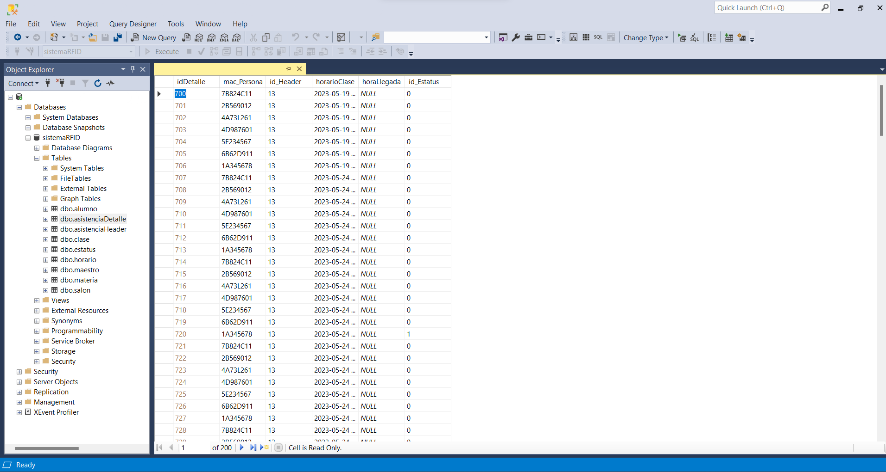

# RFID Attendance Management System


## Introduction

The RFID Attendance Management System is a project designed to manage the attendance of students and teachers within an educational institution using RFID (Radio Frequency Identification) technology. The system consists of three fundamental subsystems:

1. **RFID System**: This system comprises RFID cards with tags and a reader-transmitter device that uses the RFID NFC Data Link protocol. It enables real-time attendance registration for both students and teachers in specific classrooms.

2. **Web System**: A web-based application that allows the management of attendance information stored in the database. It enables students to view their attendance records based on the class, and teachers can monitor real-time attendance in their classes and modify attendance records if necessary.

3. **Database**: The central storage for all student, teacher, classroom, attendance, and subject information, along with their interrelations.

## Sections

### Section 1: Assembling the RFID System

To reproduce the RFID System physically, follow these detailed steps:

1. Assemble the components as shown in the figure below: ESP32, display lcd 2x16 and RFID reader.
   

### Section 2: Installing the Database

To install the database:

1. Download and Install [SQL Server Management Studio (SSMS)](https://learn.microsoft.com/es-es/sql/ssms/download-sql-server-management-studio-ssms?view=sql-server-ver16).

2. Launch SQL Server Management Studio.

3. In the "Connect to Server" window, enter the necessary connection details to connect to your SQL Server instance. This typically includes the server name and authentication method (Windows Authentication or SQL Server Authentication).

4. Once connected to the SQL Server instance, expand the "Databases" node in the Object Explorer window.

5. Right-click on the "Databases" node and select "Restore Database..." from the context menu.

6. In the "Restore Database" window, select the "Device" option under the "Source" section.

7. Click on the ellipsis button ("...") to browse for the backup file (Database/sistemaRFID.bak).

8. In the "Destination" section, choose to restore the database with the same name.

9. Click the "OK" button to start the database restore process.

10. Once the restore process is complete, the "sistemaRFID" database should appear in the Object Explorer under the "Databases" node.



### Section 3: Installing the Web System API

To install the Web System API:

1. Download and Install [Visual Studio (2019 or later)]([https://learn.microsoft.com/es-es/sql/ssms/download-sql-server-management-studio-ssms?view=sql-server-ver16](https://visualstudio.microsoft.com/es/)).

2. Launch Visual Studio.

3. Go to "File" > "Open" > "Project/Solution".

4. Browse and select the "sistemaAsistenciasAPI.sin" file.

5. After the project is loaded, right-click on the solution in the Solution Explorer and select "Restore NuGet Packages".

6. This will ensure all the required packages for the project are downloaded and installed.

7. Open the "Web.config" file in the project.

8. Look for the connection string section. It should look something like this:
```
<connectionStrings>
<add name="sistemaRFIDEntities1" connectionString="metadata=res://*/Models.sistemaRFID.csdl|res://*/Models.sistemaRFID.ssdl|res://*/Models.sistemaRFID.msl;provider=System.Data.SqlClient;provider connection string=&quot;data source=YOUR_SERVER_NAME;initial catalog=sistemaRFID;integrated security=True;MultipleActiveResultSets=True;App=EntityFramework&quot;" providerName="System.Data.EntityClient" />
</connectionStrings>
```

9. Replace "YOUR_SERVER_NAME" with the name or IP address of your SQL Server instance.

10. Go to "Build" > "Build Solution" to build the project.

11. Make sure there are no build errors.

12. Right-click on the API project in the Solution Explorer and select "Publish".

13. Choose a target location where you want to publish the API.

14. Copy the published files to the web server where you want to host the API.

15. Ensure that the web server hosting the API is running.

16. Open a web browser or use a tool like Postman to test the API endpoints.

### Section 4: Installing the Web System Dashboard

To install the Web System Dashboard:

1. Launch Visual Studio.

2. Open the dashboard project (Dashboard/sistemaAsistenciaDashboard/sistemaAsistenciaDashboard.sin) in Visual Studio.

3. Ensure that the project builds successfully without any errors.

4. Go to "Build" > "Build Solution" to compile the project.

5. Right-click on the dashboard project in the Solution Explorer.

6. Select "Publish" from the context menu.

7. In the "Publish" window, select the appropriate publishing target.
   - If deploying to a file system, choose "Folder" or "File System" as the publishing method.
   - If deploying to a web server or hosting provider, choose "Web Deploy" or "FTP."

8. Configure the publishing settings based on your chosen publishing target.
   - For "Folder" or "File System," specify the target folder where the published files will be stored.
   - For "Web Deploy" or "FTP," enter the necessary connection details (e.g., server URL, username, password) for the target server.

9. Click the "Publish" button to start the publishing process.
    
11. Once the deployment process is complete, navigate to the deployed URL (if applicable) or the target folder (if using "Folder" or "File System" publishing).

12. Test the deployed dashboard to ensure that it functions correctly in the production environment with the API.


### Section 5: Implementing the RFID system

To connect all subsystems within the same network:

1. Obtain the IP and port of the Web Server API.

2. Update the RFID_Attendance.ino code with the obtained IP and port information for proper communication. It should look something like this:

```
//======================================== Datos Http
String HOST_NAME = "YOUR_HOST_NAME";
String PATH_NAME   = "/api/Asistencia/registro";
//======================================== 
```

3. Replace "YOUR_HOST_NAME" with the name or IP address of your Web Server API.

2. Use the Arduino IDE to upload the RFID_Attendance/RFID_Attendance.ino file to the ESP32, which facilitates the communication with the RFID reader, display lcd, Wi-Fi network and the servers.

### Section 6: Initializing and Testing the Subsystems

Examples of usage:

1. Try adding students and teachers (with their personal RFID uid), subjects and schedules to the database.

2. Use the RFID device to test the attendance of a student with a compatible RFID card.

3. Test scenarios and troubleshooting tips for potential issues.

## FAQ

1. **What hardware components are required for the RFID System?**
   The RFID System requires an ESP32 with Wi-Fi capability, a display lcd, a RFID reader, a RFID card, a breadboard and wires to connect.

2. **Can I use a different RFID reader for the system?**
   Yes, as long as the reader supports the RFID cards and you set the corresponding libraries in the Arduino project.

3. **How do I install the database backup file "sistemaRFID.bak"?**
   You can install it using SQL Server Management Studio. Detailed instructions can be found in Section 2.

4. **How do I modify attendance records in the Web System?**
   Teachers can log in to the system and update attendance records for their classes.

5. **What happens if the Wi-Fi connection is lost?**
   The system may not be able to transmit real-time attendance data during the Wi-Fi outage. However, is is expected in future implementations that local attendance will still be recorded on the RFID reader.

7. **What security measures are in place to protect the system's data?**
   Ensure that you set strong passwords and employ secure network practices to safeguard the system's data.

8. **Can I use the system for multiple classrooms?**
   Yes, you can configure the system to work with multiple classrooms by expanding the database and web application.

## Conclusion

This README.md provides a comprehensive guide to setting up the IoT Attendance Management System with RFID technology. By following the step-by-step instructions in each section, you can successfully implement and test the system for efficient attendance management within an educational institution. If you encounter any issues or have further questions, please refer to the FAQ section or open an issue on the GitHub repository. Happy attendance management!
